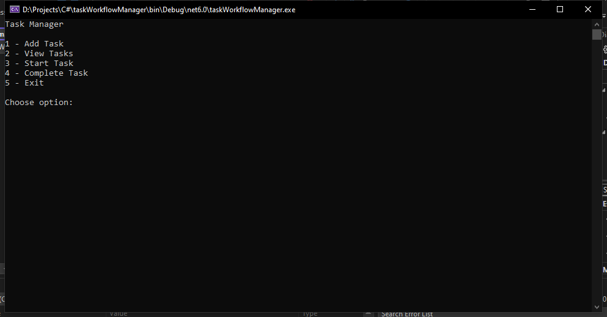
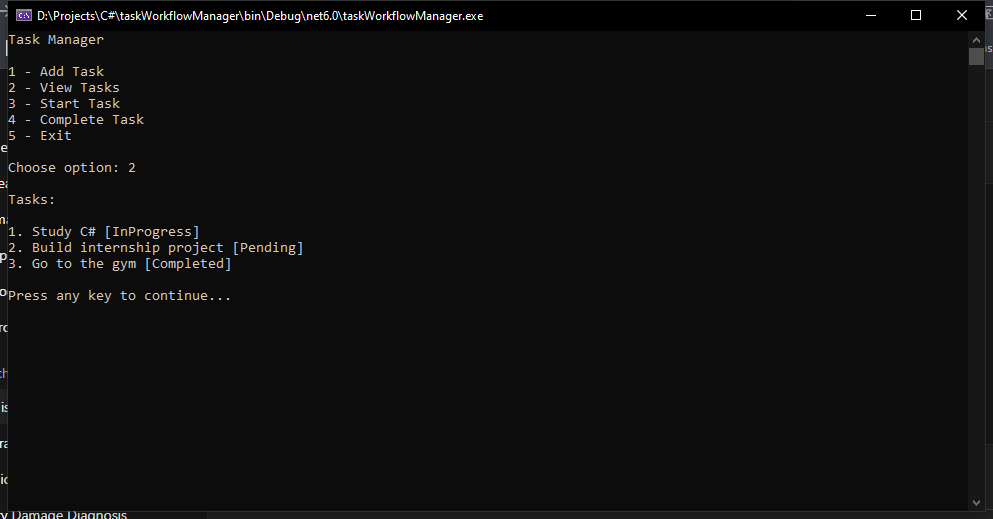
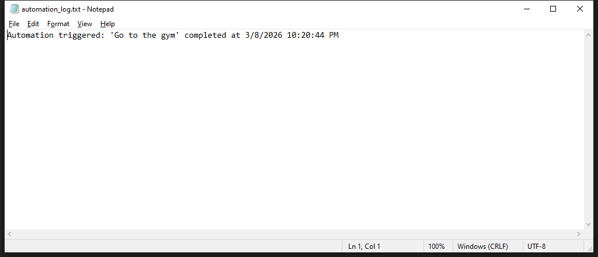

# C# Task Workflow Manager

A simple console-based task workflow manager built in C#.

This project was developed as a learning exercise to practice
object-oriented programming, workflow logic, and data persistence.

---

## Features

- Create tasks
- Track task workflow states (Pending, InProgress, Completed)
- JSON-based data persistence
- Event-driven automation rule triggered on task completion

---

## Technologies Used

- C#
- .NET Console Application
- JSON serialization (`System.Text.Json`)

---

## Project Structure

src/ → application source code
screenshots/ → program output examples
tasks.json → example task storage file

---

## Screenshots

### Main Menu

### Task List

### Automation Event

---

## Example JSON Storage

[
  {
    "Title": "Study C#",
    "Status": "Pending"
  },
  {
    "Title": "Build internship project",
    "Status": "Completed"
  }
]

---

## Purpose

This project demonstrates basic concepts including:

- Object-oriented design
- Workflow state management
- File-based data persistence
- Simple rule-based automation

---

## Author

Sinan Salameh  
Information Technology Engineering Student
